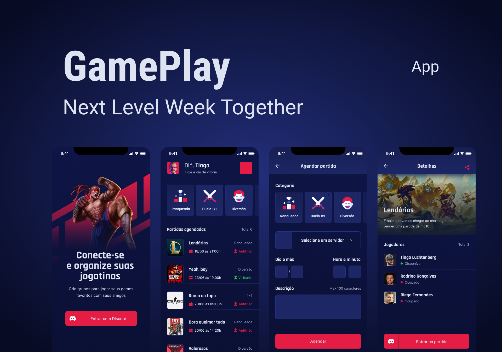

<h1 align="center">
    
</h1>

<p align="center">
  <a href="https://opensource.org/licenses/MIT">
    
  </a>
  
  

  

  
  
  <a href="https://github.com/Fekleite/plantmanager/commits/master">
    
  </a>

  <a href="https://github.com/Dougllas92/plantmanager-cli/issues">
    
  </a>
</p>

### 🧪 Tecnologias
 * Expo
 * Node.js
 * React Native
 * Typescript

## 💻 Pré-requisitos

Antes de começar, verifique se você atendeu aos seguintes requisitos:
* Expo
* Node.js
* React Native
* Npm ou Yarn

## ☕ Testando o Gameplay
Para testar o aplicativo Gameplay, leia o qrcode abaixo com o app Expo Go
<h1>
    
</h1>

## 🚀 Instalando Gameplay

Para instalar o Gameplay, siga estas etapas:

Clone o projeto e acesse a pasta

```
git clone https://github.com/Dougllas92/gameplay.git
cd gameplay
```

Instale as dependências
```
yarn install ou npm install
```

Inicie a aplicação
```
expo start
```

**Configurando a conexão com o discord**

- Acesso o site https://discord.com/developers/applications
- Clique em New Application e dê o nome de gameplay
- Acesse o OAuth2 no menu lateral
- Em redirects insira a seguinte url https://auth.expo.io/@seuusuariodoexpo/gameplay
- Em scope marque as 4 primeiras opções e copie a url
- Caso não esteja autenticado no expo em sua maquina digite no terminal expo login 
- Abra o arquivo .env.examplo e cole a url
- cole a url e desmembre conforme o exemplo abaixo
```
url: https://discord.com/api/oauth2/authorize?client_id=CLIENT_ID&redirect_uri=REDIRECT_UI&response_type=TOKEN&scope=SCOPE

REDIRECT_URI=https://auth.expo.io/@seuusuariodoexpo/gameplay
SCOPE=identify%20email%20connections%20guilds
RESPONSE_TYPE=token
CLIENT_ID=123456789
CDN_IMAGE=https://cdn.discordapp.com
```
- Feito isso, pode deletar a url do arquivo e renomeie o arquivo .env.exempla para .env

